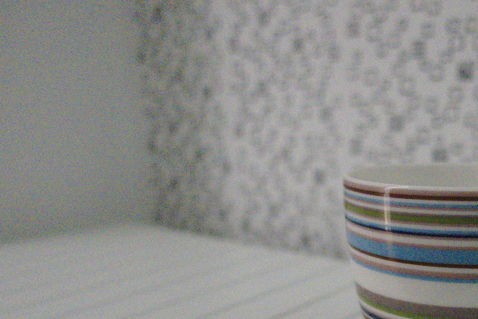
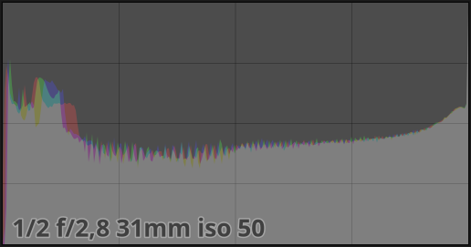
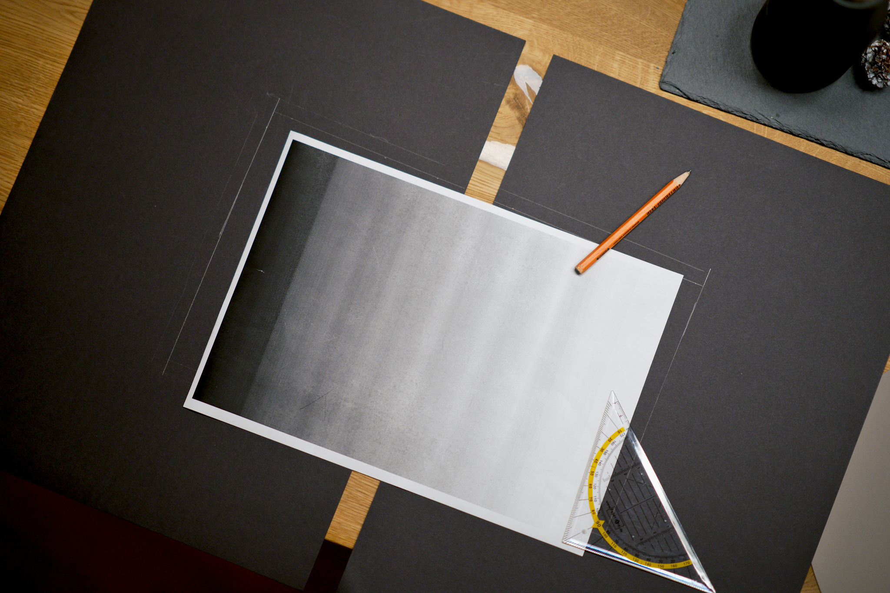
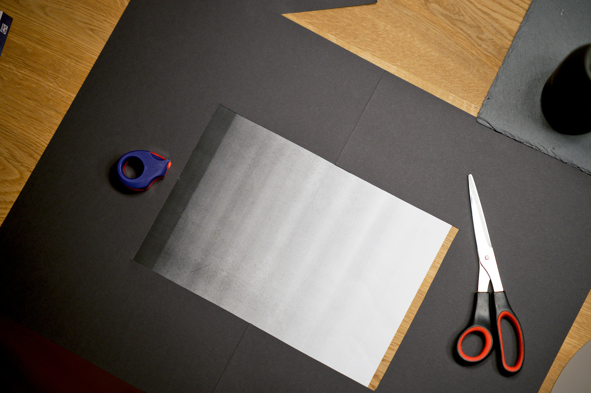
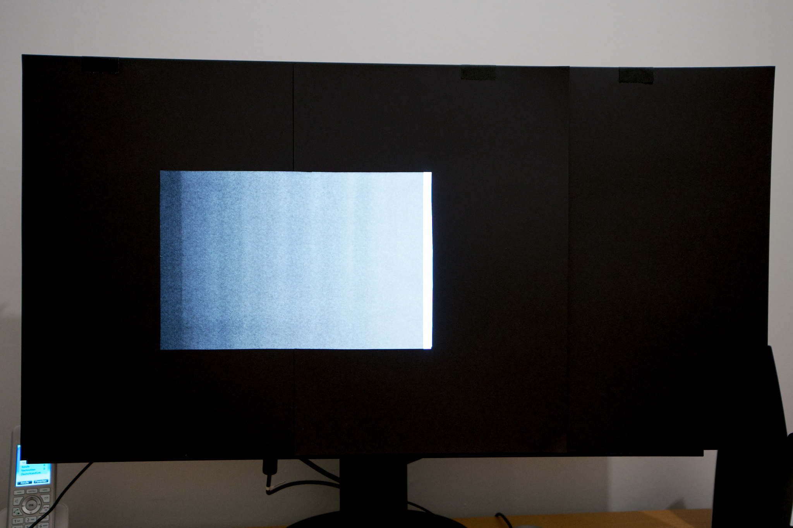
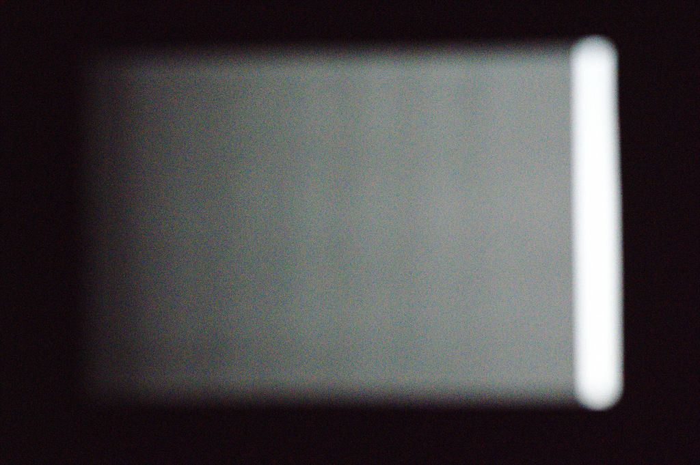
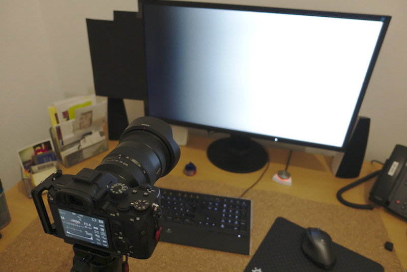

Noise in digital images is the equivalent of film grain for analogue cameras.
In digital cameras noise is either created by the amplification of digital
signals or heat produced by the sensor. It appears as random colored speckles
on an otherwise smooth surface and can significantly degrade image quality.

Noise is normally always present, but if it gets more and more, it detracts
from the image and needs to be removed or compensated. Removing noise normally
decreases image quality or sharpness. There are different algorithms to reduce
noise but the best is if we have profiles for a camera to understand the noise
patterns a camera model produces.

Noise reduction is an image restoration process. You want to remove the
digitial artefacts from the image in such a way that the original image is
discernible. The artefacts can be just some kind of grain or colorful
disturbing dots. It can either add to a picture or disturb from if. If it is
disturbing we want to remove it. The following pictures show a picture with
noise and a denoised version:

To get the best noise reduction we need to get profiles for each ISO value for
a camera.

Creating the pictures for noise profling
----------------------------------------

For every ISO value of your camera, you have to take a picture. The pictures
need to be created in a special way, with special settings, to gather the
information correctly. The photos need to be out of focus with a widespread
histogram like in the following image:

We need overexposed and underexposed areas, but mostly intersting are the grey
areas in between. They contain he information we are looking for.

But lets go through it step by step. For easier creation of the required
pictures we will create a stencil which will make it easier to capture the
photos.

### Stencil for DSLM/DSLR lenses

You need to get some thicker black paper or cardboard for it. No light should
shine through it!  First we need to use the lense hood to get the size. The
lense hood helps to move it away from the lense a bit and we have something to
attach it too. Then we need to create a punch card. For wide angle lenses you
need a close raster and for bigger focal length a wider raster. It is harder to
create it for compact cameras with small lenses (check below).

Find the middle and mark the size of the lens hood:

If you have the size, draw a grid on the paper:

Once you have done that you need to choose a punch card raster for your focal length. I use a 16mm wide angle lens on a full frame body, so I choose a raster with a lot of holes:

**Untested idea**: Use two (or three) zick zack lines instead of holes.

### Stencil for compact cameras

I guess you would create a stencil, like for bigger lenses, but create a funnel
to the camera. Contributions and ideas are welcome!

Taking the pictures
-------------------

Wait for a cloudy day with thick clouds and no sun to take the pictures. The
problem is the shutter speed and it is likely that you hit the limit. My camera
has 37 ISO values (including extended iso), so I need to start with 0.6 seconds
exposure time to take the last picture with the limit of my camera, 1/8000 of a
second exposure time. So a darker day helps to start with a slow shutter speed.

Use a tripod and point the camera to the sky, attach the lens hood and put the
punch card on it. Better make sure that all filters are removed, that we don't
get any strange artefacts from them. In the end the setup should look like
this:

Choose the fastest aperture available on your lens (e.g. f/2.8 or even faster),
change the camera to manual focus and focuse on infinity. Take the shot!
The result should look like this:

The holes will overexpose the picture but you also need an underexposed area.
So start to put most of my dark areas in the middle of the histogram and moved
it to the black (left) side of the histogram till the first values started to
clip. It is important to not to clip to much, as we are mostly interested the
grey values between the overexposed and underexposed areas.

Once you're done taking the pictures it is time to move to the computer.

Creating the noise profiles
---------------------------

### STEP 1

Run

    /usr/lib/darktable/tools/darktable-gen-noiseprofile --help

If this gives you the help of the tool continue with STEP 2 othersise go to STEP 1a

### STEP 1a

You're darktable installation doesn't offer the noise tools so you need to
compile it yourself. Before you start make sure that you have the following
dependencies installed on your system:

* git
* gcc
* make
* gnuplot
* darktable-cli

Get the darktable source code using git:

    git clone https://github.com/darktable-org/darktable.git

Now change to the source and build the tools for creating noise profiles using:

    mkdir build
    cd build
    cmake -DCMAKE_INSTALL_PREFIX=/opt/darktable -DBUILD_NOISE_TOOLS=ON ..
    cd tools/noise
    make
    sudo make install

### STEP 2

Download the pictures from your camera and change to the directory on the commandline:

    cd /path/to/noise_pictures

and run the following command:

    /usr/lib/darktable/tools/darktable-gen-noiseprofile -d $(pwd)

or if you had to download the source, run

    /opt/darktable_source/lib/tools/darktable-gen-noiseprofile -d $(pwd)

This will automatically do everything for you. Note that this can take quite
some time to finish. I think it took 15 to 20 minutes on my machine. If a
picture is not shot correctly, the tool will tell you the image name and you
have to recapture the picture with that ISO.

Once the tool finished, you end up with a tarball you can send to darktable for
inclusion. You can open a bug at:

> https://redmine.darktable.org/

for that. The tool will tell you, once completed, how to test and verify the
noise profiles you created.

The interesting files are the presets.json file (darktable input) and for the
developers the noise_result.pdf file. You can find an example
[here](ilce-7m3_noise_result.pdf). It is a
collection of diagrams showing the histogram for each picture and the results
of the calculations.

A detailed explanation of the diagrams and the math behind it can be found in
[the original noise profile
tutorial](https://www.darktable.org/2012/12/profiling-sensor-and-photon-noise/)
by Johannes Hanika.

For discussion
--------------

I've created the stencil above to make it easier to create noise profiles.
However I've tried different ways to create the profiles and here is one which
was a good idea but failed for low ISO values (ISO <= 320). We are in the open
source world, and I think it is important to share failures too. Others may
have an idea to improve it or at least learn from it.

For a simpler approach than the one described above, I've created a [gradient
from black to white](noise_profile.png). Then I used some black cardboard to
attached it to the monitor to get some real black.  Remember you need an
underexposed area and the monitor is not able to output real black, as it is
backlit.

In the end my setup looked liked this:

I've turned off the lights and took the shots. However the results for ISO
values below and equal to ISO320 are not good. All other ISO values looked
fine.

If you're interested in the results, you can find them here:

* [noise_profile.pdf](ilce-7m3_failed_monitor_gradient_noise_result.pdf)
* [dt-noiseprofile.tar.gz](ilce-7m3_failed_monitor_gradient_dt-noiseprofile-20180407.tar.gz)

Feedback is very much welcome :-)
